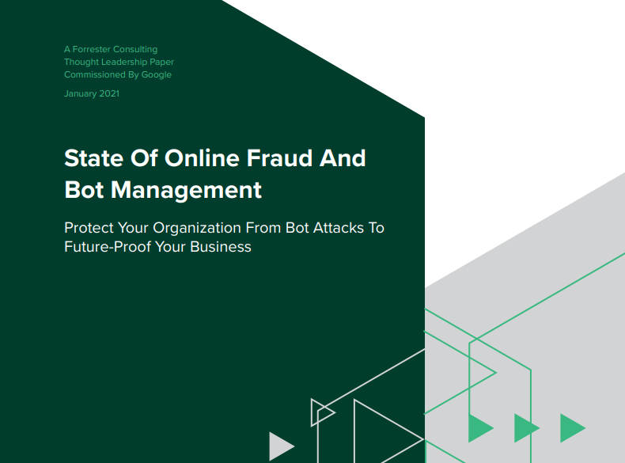

# I'm not a robot

Full paper inside 'papers' folder.

# Impacts

# Financial Impact

# Bot Management

# Are Your Holiday Shoppers Human? (HUMAN + PerimeterX)

https://www.youtube.com/watch?v=sXsiY6yny94

# Why Should You Care About Bots? | Netacea

Humans have become a minority of internet users, with automated bot traffic accounting for more than half of all internet traffic. The bots are becoming more sophisticated as they seek to evade detection.

https://www.youtube.com/watch?v=OY3fY-wbJMQ

## Threat Landscape

# Emerging Threats

# 2009-12-14 1600 Hrs

